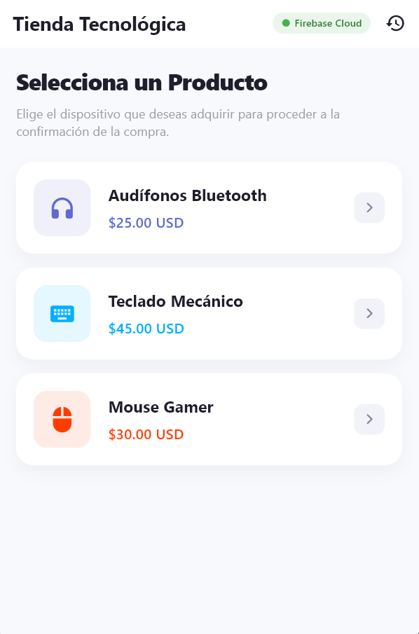
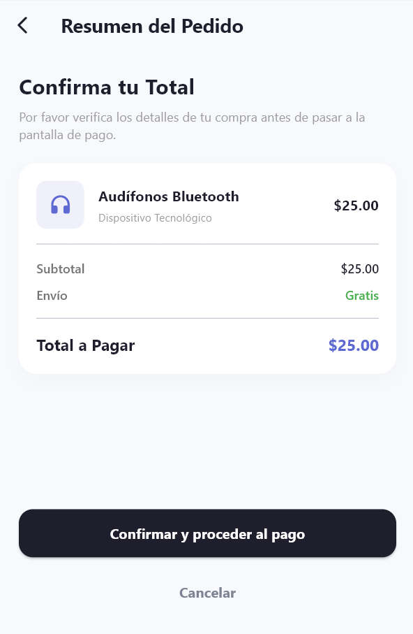
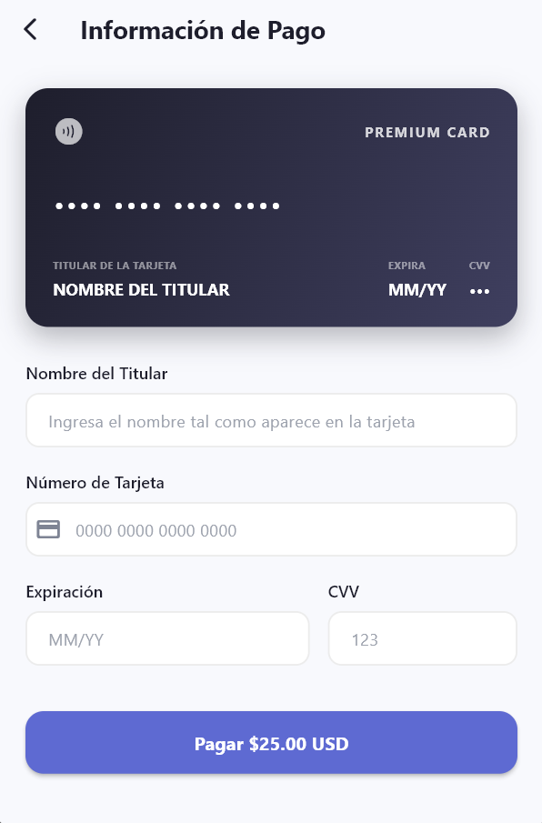
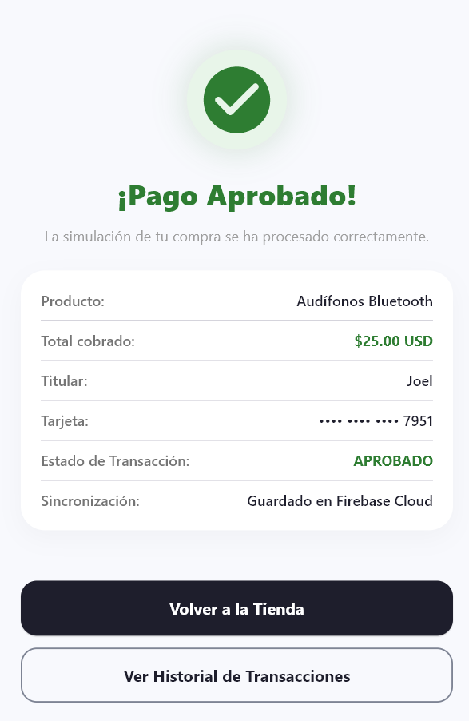
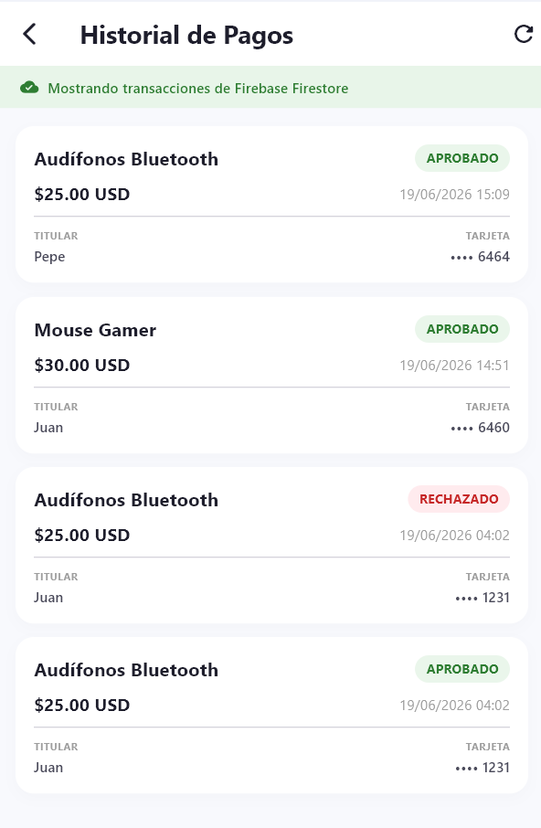
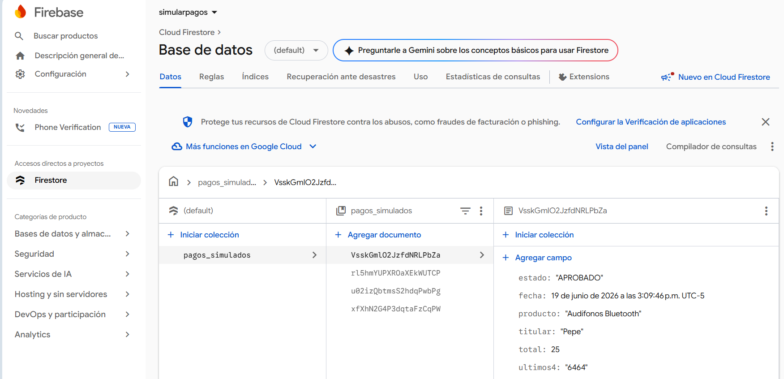

# Taller: Simulación de Pagos en Flutter con Firebase Firestore

Este proyecto es una aplicación móvil desarrollada en **Flutter** que simula una pasarela de pagos integrada con **Firebase Firestore** como base de datos en la nube y un sistema de almacenamiento local alternativo como fallback (modo sin conexión).

---

## 📋 Informe del Proyecto

### 🔄 1. Flujo Funcional de la Aplicación
El flujo de la aplicación se divide en 5 pasos secuenciales e intuitivos:
1. **Productos (Catálogo)**: Pantalla de inicio donde se muestran los productos disponibles (*Audífonos Bluetooth*, *Teclado Mecánico*, *Mouse Gamer*) con sus respectivos precios y un indicador visual de conectividad en tiempo real (Firebase Cloud / Local Sandbox).
2. **Resumen**: Pantalla de transición donde se desglosan los costos del producto seleccionado (subtotal, envío y total a pagar) y se requiere la confirmación del usuario para proceder.
3. **Pago**: Formulario de checkout de alta fidelidad estética que incluye una tarjeta de crédito interactiva que refleja en tiempo real los datos que el usuario va digitando (nombre, número, fecha y CVV).
4. **Resultado**: Pantalla que muestra el estado de la transacción, el cual se simula de manera aleatoria como **APROBADO** (interfaz verde con check) o **RECHAZADO** (interfaz roja con alerta).
5. **Historial**: Sección donde se consultan de manera cronológica (más recientes primero) todas las transacciones realizadas, mostrando su estado, fecha, producto y datos del titular de forma persistente.

---

### 🛡️ 2. Reglas de Validación del Formulario
El formulario de pago cuenta con validadores en tiempo real y formateadores de texto automáticos para evitar errores de entrada:
* **Nombre del Titular**: Campo obligatorio. Bloquea el envío si está vacío.
* **Número de Tarjeta**: Campo obligatorio. Debe tener exactamente 16 dígitos (sin contar espacios).
  * *Formateador*: Añade un espacio automáticamente cada 4 dígitos (`XXXX XXXX XXXX XXXX`) a medida que el usuario escribe.
* **Fecha de Expiración**: Campo obligatorio con formato `MM/YY`.
  * *Formateador*: Añade automáticamente una barra diagonal (`/`) después de ingresar el mes.
  * *Validador*: Comprueba que el mes esté en el rango de `01-12` y que el año/mes no sean menores a la fecha actual del dispositivo (bloquea tarjetas expiradas).
* **CVV**: Campo obligatorio de exactamente 3 dígitos. Mantiene el texto oculto (*obscured*) para mayor privacidad.

---

### 🔒 3. Seguridad y Datos Almacenados
Siguiendo las directrices del taller y las normativas de cumplimiento de seguridad de datos (PCI-DSS):
* **Datos que SÍ se guardan**:
  * Nombre del producto.
  * Total de la transacción.
  * Nombre del titular de la tarjeta.
  * **Últimos 4 dígitos de la tarjeta** (obtenidos de forma segura mediante extracción en memoria justo antes de guardar).
  * Estado de la simulación (`APROBADO` o `RECHAZADO`).
  * Fecha y hora exacta de la transacción (`Timestamp`).
* **Datos que NO se guardan**:
  * **Número de tarjeta completo**: Es descartado en memoria inmediatamente tras pasar la validación local. Nunca se envía ni a Firestore ni al almacenamiento local de SharedPreferences.
  * **Código de seguridad (CVV)**: Jamás se almacena ni se transmite a ninguna base de datos.

---

## 📸 Capturas de Pantalla (Assets)

### Pantalla 1: Selección de Productos (Catálogo)
Muestra la lista de productos y el estado de la conexión en la parte superior derecha.

---

### Pantalla 2: Resumen del Pedido
Pantalla intermedia para la confirmación de costos antes del pago.

---

### Pantalla 3: Formulario de Pago con Tarjeta Interactiva
El formulario interactivo con validaciones y la tarjeta en tiempo real.

---

### Pantalla 4: Resultado de la Transacción (Aprobado o Rechazado)
Ejemplo de pantalla tras procesarse el resultado simulado de la compra.

---

### Pantalla 5: Historial de Transacciones
Visualización persistente de los pagos procesados y guardados.

---

### Base de Datos: Cloud Firestore en Firebase Console
Captura de pantalla de la base de datos de Firebase.

